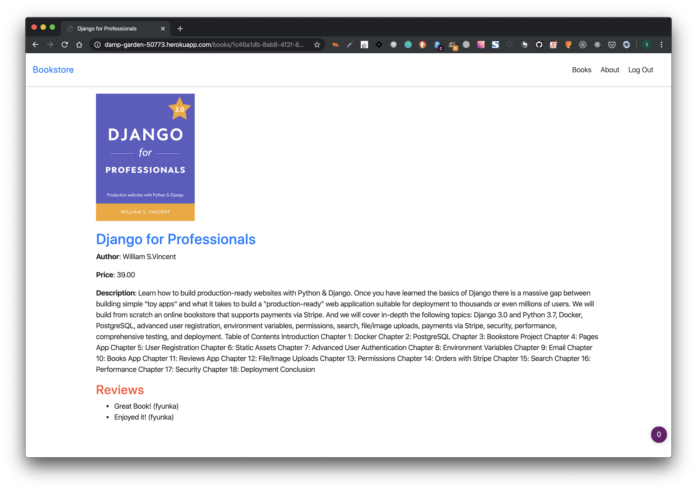

# Online Bookstore App

## Introduction

### Learn how to build production-ready websites with Python & Django.

Once you have learned the basics of Django there is a massive gap between building simple "toy apps" and what it takes to build a "production-ready" web application suitable for deployment to thousands or even millions of users.

We will build from scratch an online bookstore that supports **payments via Stripe**. And we will cover in-depth the following topics: **Django 3.0** and **Python 3.7**, **Docker**, **PostgreSQL**, advanced user registration, environment variables, permissions, search, file/image uploads, payments via Stripe, security, performance, comprehensive testing, and deployment.

## App Demo

[Online Bookstore Demo](https://damp-garden-50773.herokuapp.com/)

For demo purposes, please use the following credentials:

**login email:** testuser@email.com

**password:** testpass123

